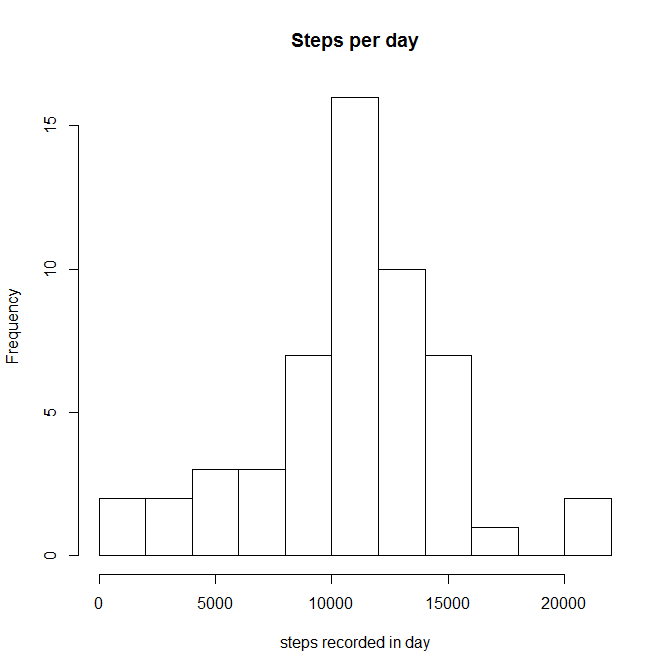

# Reproducible Research: Peer Assessment 1


## Loading and preprocessing the data
The analysis searches first for the unzipped file **activity.csv**, if absent 
then the zipped archive **activity.zip** (assuming them to be in the same directory as the .Rmd script generating this output).  
Failing this the .zip file is called from a given url ***(http://d396qusza40orc.cloudfront.net/repdata%2Fdata%2Factivity.zip)***. This is the choice of last resort given the potential for URLs to change.  
The file is extracted as required and the data read into the dataframe **rawData**.  
The option cache = TRUE is used to ensure this process is performed only when necessary.


```r
   if(file.exists("activity.csv")){
       rawData<-read.csv("activity.csv")
   } else if(file.exists("activity.zip")){
        unzip("activity.zip")
        rawData<-read.csv("activity.csv")         
   } else{
         temp<-tempfile()
         download.file("http://d396qusza40orc.cloudfront.net/repdata%2Fdata%2Factivity.zip",temp)
        unzip(temp)
         rawData<-read.csv("activity.csv")          
  } 
```
The time codes in this data set have no standard tokens to allow parsing of the hrs:mins data. The function **parseTimeData** performs this extraction, and creates a Posix conformant object with a placeholder date and the appropriate hr:min values. The utility of this step will be shown later. The function assumes that the package **lubridate** is available and loaded


```r
#  pass the numeric time code to the function
parseTimeData<-function(timeStr){
# use integer division to extract the hour value
    hr<-timeStr%/%100
# use modulus to extract the minute value       
    mn<-timeStr%%100
# create a constant placeholder date
    interval<-dmy("1/1/2000")
# append the hour and minute values to the fate object
    hour(interval)<-hr
    minute(interval)<-mn
# return
    return(interval)
}

# accesss the lubridatebpackage
library(lubridate)
# set the significant figures
options(digits=7)
# convert the date values to posix conformant objects
asDates<-ymd(rawData$date)
# replace the date column with this vector
rawData$date<-asDates
# parse the time codes with parseTimeData() to date objects
times<-parseTimeData(rawData$interval)
# replace the interval column with this vector
rawData$interval<-times
# re-order the columns in the dataframe
rawData<-rawData[,c("date","interval","steps")]
```

## What is mean total number of steps taken per day?

This analysis can be performed by aggregating the data by the date values  
and defining the function as 'sum'.  
The 'granularity' of the histogram is optimised by using 'breaks=15' as an option  
The statistics associated with the distribution of total steps per day are determined  
with the summary() function, mean and median values extracted as required


```r
stepByDate<-aggregate(steps~date,data=rawData,FUN=sum)
hist(stepByDate$steps,breaks=15,main="Steps per day")
```

 

```r
stepStats<-summary(stepByDate$steps)
print(stepStats['Mean']) 
```

```
##  Mean 
## 10770
```
The mean steps recorded per day is **10770**

## What is the average daily activity pattern?


## Imputing missing values


## Are there differences in activity patterns between weekdays and weekends?
