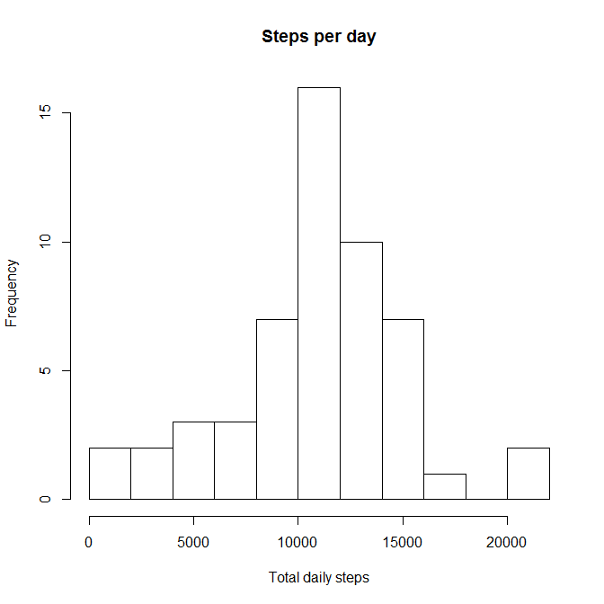

# Reproducible Research: Peer Assessment 1


## Loading and preprocessing the data
The analysis searches first for the unzipped file **activity.csv**, if absent 
then the zipped archive **activity.zip** (assuming them to be in the same directory as the .Rmd script generating this output).  
Failing this the .zip file is called from a given url ***(http://d396qusza40orc.cloudfront.net/repdata%2Fdata%2Factivity.zip)***. This is the choice of last resort given the potential for URLs to change.  
The file is extracted as required and the data read into the dataframe **rawData**.  
The option cache = TRUE is used to ensure this process is performed only when necessary.


```r
   if(file.exists("activity.csv")){
       rawData<-read.csv("activity.csv")
   } else if(file.exists("activity.zip")){
        unzip("activity.zip")
        rawData<-read.csv("activity.csv")         
   } else{
         temp<-tempfile()
         download.file("http://d396qusza40orc.cloudfront.net/repdata%2Fdata%2Factivity.zip",temp)
         unzip(temp)
         rawData<-read.csv("activity.csv")          
  } 
```
The time codes in this data set have no standard tokens to allow parsing of the hrs:mins data. The function **parseTimeData()** performs this extraction, and creates a Posix conformant object with a constant placeholder date and the appropriate hr:min values. The utility of this step will be shown later. The function assumes that the package **lubridate** is available and loaded


```r
#  pass the numeric time code to the function
parseTimeData<-function(timeStr){
# use integer division to extract the hour value
    hr<-timeStr%/%100
# use modulus to extract the minute value       
    mn<-timeStr%%100
# create a constant placeholder date
    interval<-dmy("1/1/2000")
# append the hour and minute values to the date object
    hour(interval)<-hr
    minute(interval)<-mn
# return
    return(interval)
}

# accesss the lubridatebpackage
library(lubridate)
# set the significant figures
options(digits=7)
# convert the date values to posix conformant objects
asDates<-ymd(rawData$date)
# replace the date column with this vector
rawData$date<-asDates
# parse the time codes with parseTimeData() to date objects
times<-parseTimeData(rawData$interval)
# replace the interval column with this vector
rawData$interval<-times
# re-order the columns in the dataframe
rawData<-rawData[,c("date","interval","steps")]
```

## What is mean total number of steps taken per day?

This analysis can be performed by aggregating the data by the date values  
and defining the function as 'sum'.  
The 'granularity' of the histogram is optimised by using 'breaks=15' as an option  
The statistics associated with the distribution of total steps per day are determined  
with the summary() function, mean and median values extracted as required


```r
stepByDate<-aggregate(steps~date,data=rawData,FUN=sum)
hist(stepByDate$steps,breaks=15,main="Steps per day", xlab="steps recorded in day")
```

 

```r
stepStats<-summary(stepByDate$steps)
print(stepStats['Mean']) 
```

```
##  Mean 
## 10770
```

```r
print(stepStats['Median'])
```

```
## Median 
##  10760
```
The mean steps recorded per day is **10770**   
The median value is **10760**  


## What is the average daily activity pattern?
The interval values are expressed as posixCt compliant objects with the same placeholder date for each.  
Therefore aggregating on the interval values will extract and aggregate data for each timepoint *within* the day  


```r
thruDay<-aggregate(steps~interval,data=rawData,FUN=mean)
plot(thruDay,type="l")
```

 
     
The next task is to determine which interval has the highest mean steps associated  
with it

```r
maxit<-thruDay[which.max(thruDay$steps),]
print(maxit)
```

```
##                interval    steps
## 104 2000-01-01 08:35:00 206.1698
```

```r
moo<-maxit$interval
maxtime<-paste(hour(moo),minute(moo),sep=":")
```
The 5minute interval in which the maximum average number of steps was recorded is **8:35** with an average value of 206.2 .


## Imputing missing values
Generate a copy of the rawData dataframe in order to perform the imputation required  
Check copy is faithful to the original  

```r
assign("copy",rawData)
identical(rawData,copy)
```

```
## [1] TRUE
```
Total NA values in the data set:  

```r
   NA_yes<-is.na(copy$steps)
   numNAs<-sum(NA_yes)
```
The total number of NAs in the data set is 2304  
  
Perform data imputation by replacing any NA value with the mean steps value calculated for the corresponding interval value.

```r
for(i in 1:length(NA_yes)){
    if(NA_yes[i]){
        s<-copy[i,]
        index<-which(thruDay[,1]==copy[i,2])
        nuStep<-thruDay[index,2]
        copy[i,3]<-nuStep
    }
}    

stepByDate2<-aggregate(steps~date,data=copy,FUN=sum)
    par(mfrow = c(2, 1))
    par(oma=c(0,0,0,0))
    par(mar=c(4,4,3,1))
hist(stepByDate$steps,breaks=15,main="Steps per day",ylim=c(0,25),xlab="Total Daily Steps")
hist(stepByDate2$steps,breaks=15,main="Steps per day: post imputation of NAs",ylim=c(0,25),xlab="Total Daily Steps")
```

 

```r
stepStats2<-summary(stepByDate2$steps)
print(stepStats)
```

```
##    Min. 1st Qu.  Median    Mean 3rd Qu.    Max. 
##      41    8841   10760   10770   13290   21190
```

```r
print(stepStats2)
```

```
##    Min. 1st Qu.  Median    Mean 3rd Qu.    Max. 
##      41    9819   10770   10770   12810   21190
```
The use of this imputation method causes the **central intervals** in the distribution to markedly increase their recorded frequency with only minimal changes to the **right and left tail** of the distribution.

## Are there differences in activity patterns between weekdays and weekends?
